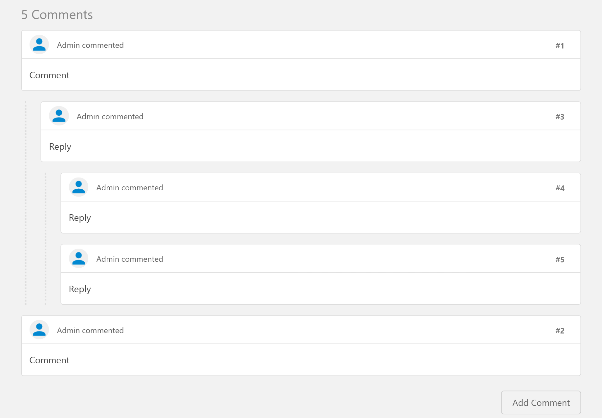
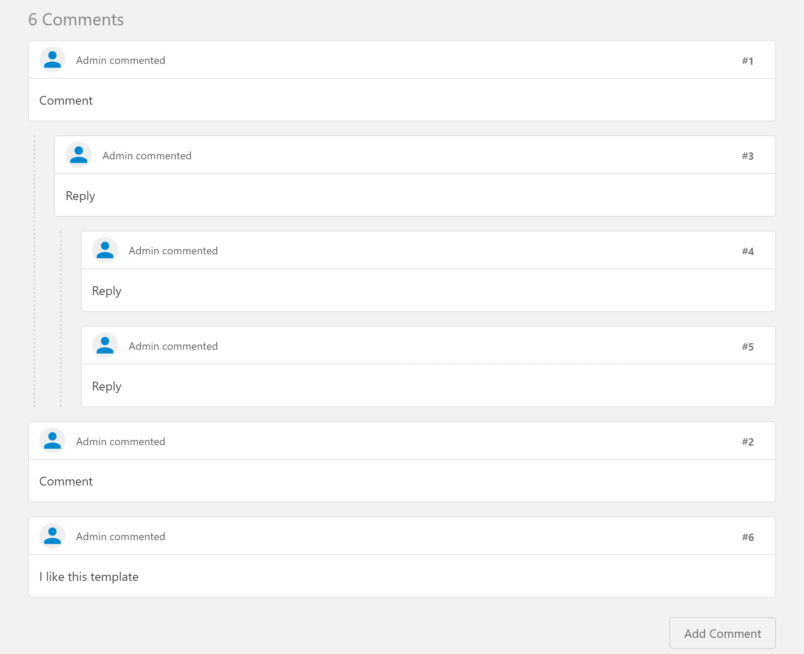
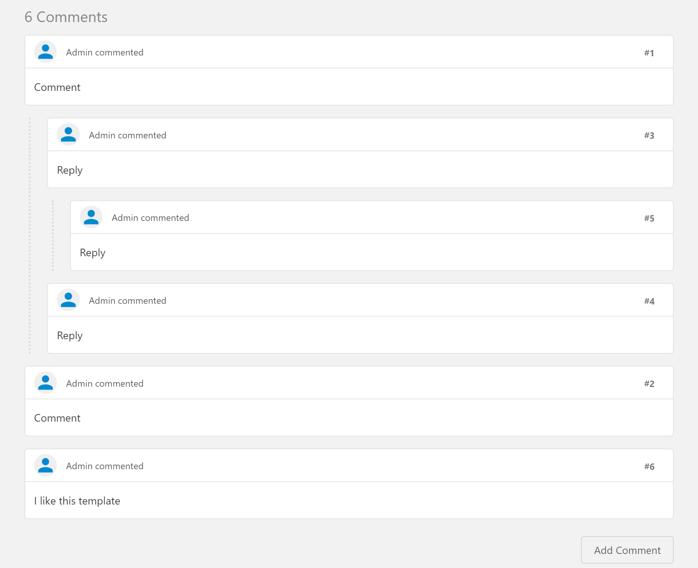

# Examples

This folder demonstrates how **WebTestPilot** and each baseline execute a test case end-to-end, with detailed **screenshots, execution traces, and logs**.

We provide both **bug-free** and **bug-injected** runs to illustrate how different approaches behave under realistic conditions.

## 📂 Structure

```graphql
/test_case   # Test specification (comment.yaml) and injected bug (comment.js)
/no_bug      # Execution results on the correct (bug-free) application
/bug         # Execution results with the injected bug (affects final step)
```

## 🧪 Test Case Description

A user logs into the system and navigates from the dashboard to the *Page Template* page. After confirming that the page has loaded correctly, the user scrolls down to locate the comments section.

The user then initiates the process of adding a new comment by clicking the **“Add Comment”** button. A rich text (WYSIWYG) editor is expected to appear, along with **“Save Comment”** and **“Cancel”** controls.

Next, the user types a message (“I like this template”) into the editor and submits it by clicking **“Save Comment”**.

Finally, the system should reflect the newly added comment. Importantly, the updated comments section must:

* Contain **exactly one additional comment**, and
* Preserve the **existing hierarchical structure and content** of the comment thread.

## 🐞 Injected Bug

The injected bug causes the **hierarchical structure of the comment chain to become inconsistent** after adding a new comment.

This means that although a new comment may appear, the overall structure (e.g., nesting, ordering, or parent-child relationships) is incorrectly modified.

<table align="center">
  <tr>
    <td align="center">
      <div style="background-color: white; width: 260px; height: 200px; display: flex; align-items: center; justify-content: center;">
        
      </div>
      <em>(a)</em>
    </td>
    <td align="center">
      <div style="background-color: white; width: 260px; height: 200px; display: flex; align-items: center; justify-content: center;">
        
      </div>
      <em>(b)</em>
    </td>
    <td align="center">
      <div style="background-color: white; width: 260px; height: 200px; display: flex; align-items: center; justify-content: center;">
        
      </div>
      <em>(c)</em>
    </td>
  </tr>
</table>

<p align="center">
  <em>
    Figure: (a) Before adding a comment; (b) after adding a comment with the expected structure preserved; 
    (c) after adding a comment with a bug causing inconsistent comment hierarchy.
  </em>
</p>